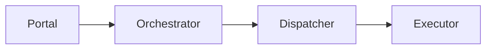
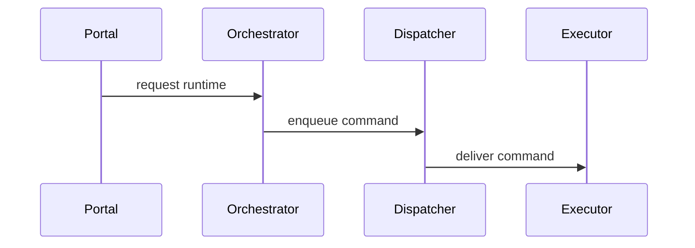

# Architecture

## Pattern Overview

**Overall:** DDD services with async runtime coordination.

## System Context

**Actors:**
- Developers

**External Systems:**
- Kubernetes
- Message bus

## System Topology / Context Map

**Call direction rules:**
- Portal enters through Orchestrator, Dispatcher owns runtime delivery, and Executor connects outward.

## Module Architecture Cards

#### Orchestrator
**Responsibility:** Owns work admission and dispatch planning.
**Path / entry:** `cmd/orchestrator/` -> `internal/orchestrator/`
**Internal layers / components:** Evidence Plane; State And Policy Plane; Dispatch Plane; Surface Plane.
**Interactions:** Receives Portal requests and asks Dispatcher to deliver runtime commands.
**State / invariants:** Dispatch decisions are idempotent.
**Source refs:** `architecture-orchestrator.md`

## Named Scenario Sequences

### Runtime Message Chain

**Source refs:** `architecture-runtime-message-chain.md`
