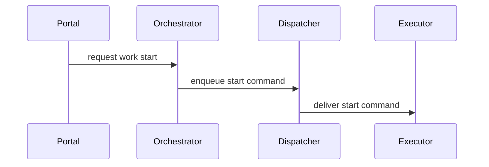
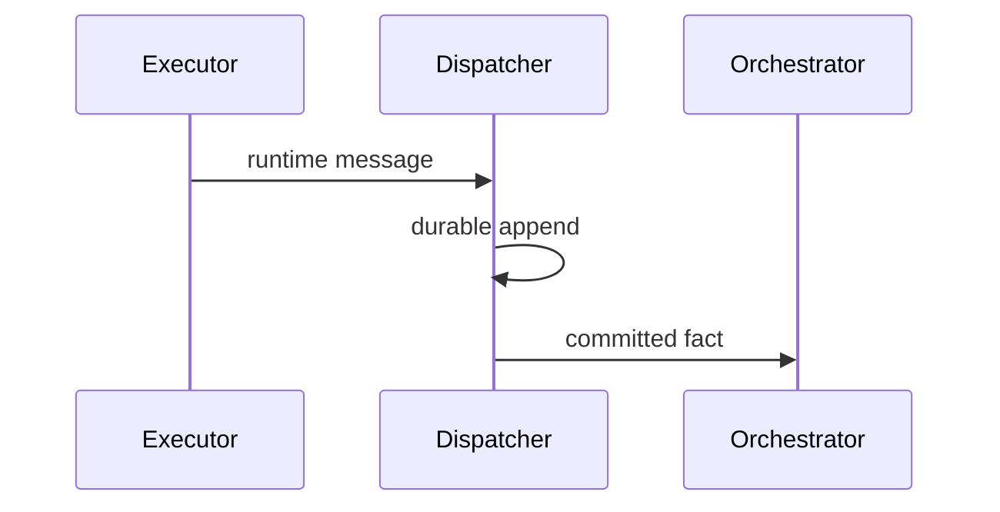
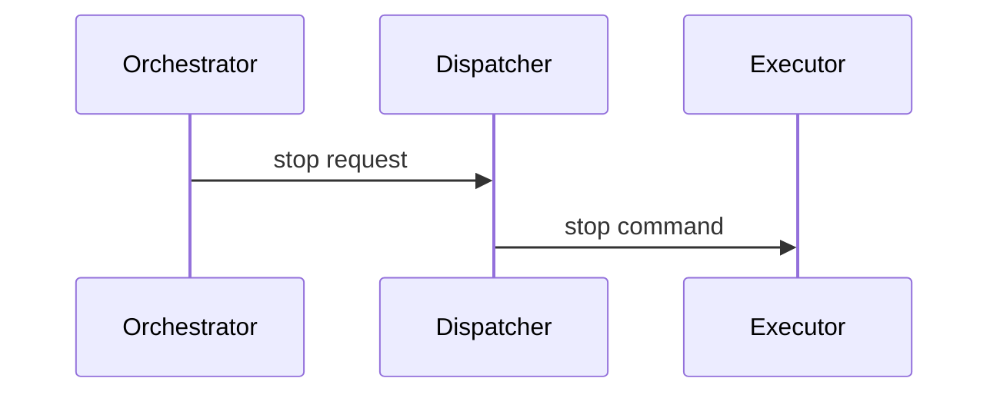
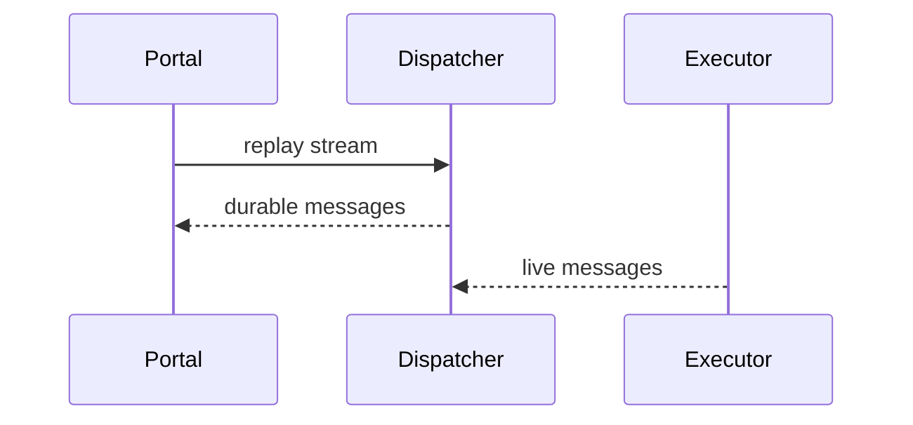
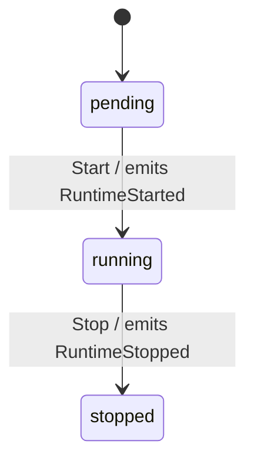

# Architecture Flows

## Scenario Sequences

### Start Runtime

**Source refs:** `cmd/orchestrator/`, `cmd/dispatcher/`, `cmd/executor/`.

### Deliver Runtime Message

**Source refs:** `api/dispatcher/v1/dispatcher.proto`, `internal/dispatcher/`.

### Stop Runtime

**Source refs:** `api/orchestrator/v1/orchestrator.proto`, `api/executor/v1/executor.proto`.

### Replay Runtime

**Source refs:** `internal/dispatcher/`, `api/dispatcher/v1/dispatcher.proto`.

## Key Object FSMs

