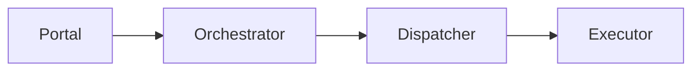

# Architecture

## Pattern Overview

**Overall:** DDD services with async runtime coordination.

## System Context

**Actors:**
- Developers

**External Systems:**
- Kubernetes
- Message bus

## System Topology / Context Map

**Call direction rules:**
- Portal enters through Orchestrator, Dispatcher owns runtime delivery, and Executor connects outward.
