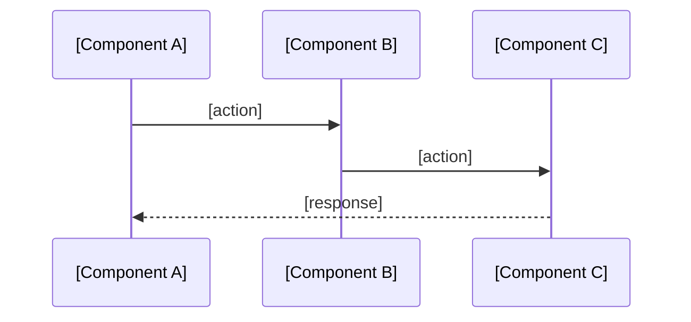

<!-- OWNER: Structure — components, module responsibilities, how modules are wired, data flows.

     BOUNDARY vs features.md:
     - This file describes HOW the system is structured (modules, boundaries, communication).
     - features.md describes WHAT the system can do (capabilities from the outside).
     If you're writing about a capability's user-facing behavior, it belongs in features.md.
     If you're writing about component wiring or data flow, it belongs here.

     Design decision rationale belongs in decisions.md — reference by ADR number only.
     Domain term business definitions belong in glossary.md — use term names only here.

     CONTENT EXCLUSION: Do NOT include information that AI can get by reading 1-2 source files
     and that may change without an architectural decision:
     - Struct/class field lists
     - Enum/constant value mappings (e.g., int8: 0=Skill)
     - Method signatures (unless enforcing non-obvious invariants)
     - Single-module implementation details

     TARGET: ≤200 lines. -->

# Architecture

## Pattern Overview

<!-- Architecture paradigm + 2-3 key characteristics. One paragraph. -->

**Overall:** [Pattern name: e.g., "DDD + Clean Architecture", "Layered API", "Full-stack MVC"]

**Key Characteristics:**
- [e.g., "Vertical slicing by bounded context"]
- [e.g., "Stateless request handling"]

## System Boundaries

<!-- C4 L1: Who/what uses this system? What external services does it depend on?
     List external actors (users, other systems) and external dependencies (databases, APIs). -->

**Actors:**
- [e.g., "Browser client (React SPA)"]
- [e.g., "CI/CD pipeline"]

**External Dependencies:**
- [e.g., "PostgreSQL 15 — primary data store"]
- [e.g., "Redis — session cache"]

## Components

<!-- C4 L2-L3: Core modules/components.
     DDD: Bounded Context list + responsibilities + aggregate root names
     Layered: Layer responsibilities + locations
     Microservices: Service list + responsibilities + communication

     Each component: name, responsibility (1 sentence), location, key abstraction name only.
     Note: location is retained as navigation index, exempt from exclusion rule.
     DO NOT include field lists or method signatures. -->

**[Component/Context Name]** — [One sentence responsibility]. Location: `path/to/module/`
- Key abstractions: [Aggregate root names, core interface names — names only, no signatures]

## Data Flow

<!-- 2-3 core cross-module scenarios using Mermaid sequenceDiagram.
     Only include flows that span 3+ components.
     Single-module internal flows do not belong here. -->

## Key Design Decisions

<!-- 3-5 architectural decisions affecting the whole system.
     Summary only — detailed rationale in decisions.md, reference by ADR number. -->

- **[Decision title]** — [one sentence summary] (ADR-NNN)

## Entry Points [OPTIONAL]

<!-- File paths of main entry points. Only include if project has multiple entry points. ≤10 lines. -->

## Layers [OPTIONAL]

<!-- Layer names + dependency direction. Reference to design pattern docs if applicable. ≤10 lines.
     Example: domain → application → infrastructure (dependency inversion via interfaces) -->

## Error Handling [OPTIONAL]

<!-- System-level error strategy only. Code-level patterns go in conventions.md.
     Example: "Services return domain errors; handlers translate to HTTP status codes" -->

## Cross-Cutting Concerns [OPTIONAL]

<!-- Logging, validation, authentication approaches. Only if project-wide and non-obvious. -->
